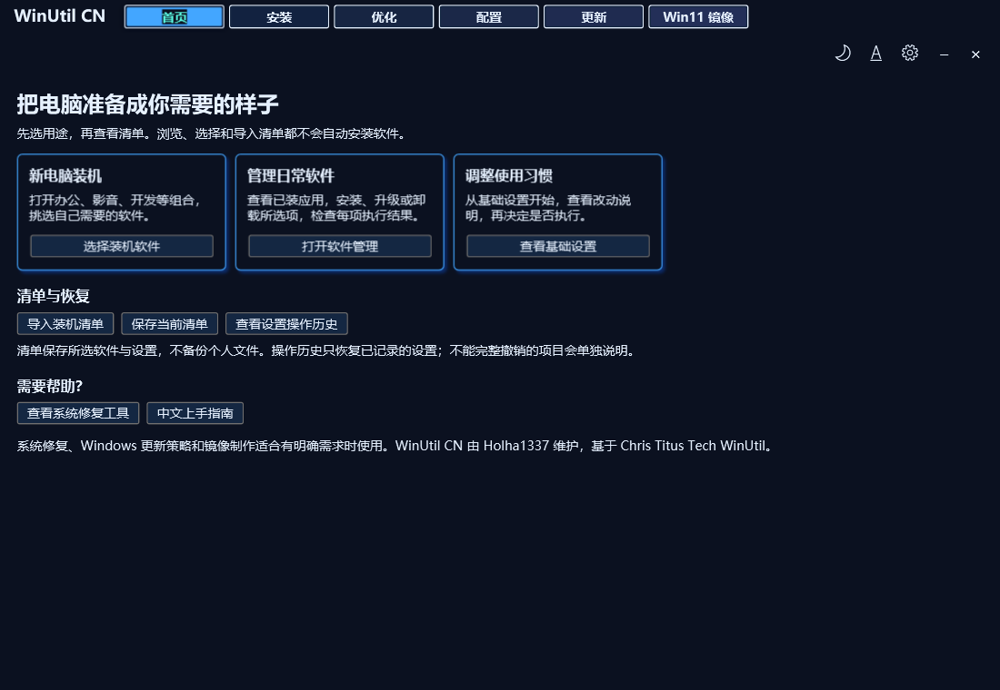

<div align="center">
  
</div>

<h1 align="center">WinUtil CN 中文装机与维护助手</h1>

<p align="center">选好软件、看清改动，让 Windows 装机和日常维护更省心。</p>
<p align="center">基于 Chris Titus Tech Windows Utility · 中文本地化分支</p>
<p align="center"><b>汉化作者与维护者：<a href="https://github.com/yasewang1337-svg">Holha1337</a></b></p>

<p align="center">
  <a href="https://github.com/yasewang1337-svg/winutil-cn/releases/latest/download/WinUtil-CN.exe"><b>下载 WinUtil-CN.exe</b></a> ·
  <a href="https://github.com/yasewang1337-svg/winutil-cn/releases/latest">发布说明与校验文件</a> ·
  <a href="docs/content/userguide/getting-started/_index.md">中文上手指南</a>
</p>

<p align="center">
  
  
  <a href="https://github.com/yasewang1337-svg/winutil-cn/releases/latest"></a>
  <a href="LICENSE"></a>
</p>

刚买电脑、刚重装系统，或想集中管理常用软件，都可以从首页开始。项目提供中文软件介绍、按用途整理的装机组合、系统设置与常见修复入口，也保留主题、字体缩放、开发环境换源和 MCP 等功能。

<div align="center">
  
  <p><i>界面预览：由本版本实际 XAML 渲染，用于展示布局；不代表全部系统操作均完成真机验证。</i></p>
</div>

## 三步开始

1. **下载**：[WinUtil-CN.exe](https://github.com/yasewang1337-svg/winutil-cn/releases/latest/download/WinUtil-CN.exe)。版本说明和 SHA256SUMS.txt 在[发布页](https://github.com/yasewang1337-svg/winutil-cn/releases/latest)。
2. **打开**：双击 EXE，按 Windows 提示授予管理员权限，再从首页选择用途。
3. **核对后执行**：调整软件或设置清单，查看操作范围，确认执行后检查结果。

EXE 内嵌本版本脚本，使用 Windows 自带 PowerShell 5.1，正常使用不必另装 PowerShell 7。首次准备包管理器、下载安装软件和更新仍需联网；单文件启动不代表离线安装所有软件。

## 日常能做什么

| 场景 | 使用方式 |
| --- | --- |
| 新电脑装机 | 打开办公、开发、影音等组合，预览用途并调整候选，再加入安装清单 |
| 管理软件 | 安装、升级或卸载所选软件前查看计划；结束后逐项检查状态、原因和日志 |
| 调整基础设置 | 先选少量设置、读清说明，再执行；默认方案不含批量卸载应用或禁用服务 |
| 查看与恢复设置 | 查看操作历史，恢复有记录的注册表值和服务启动配置 |
| 保存装机选择 | 导出当前清单；下次从图形界面导入、核对勾选后再执行 |
| 查找系统工具 | 从首页进入修复工具、Windows 配置及更新管理 |

**装机组合可以调整。** 办公组合默认推荐微信和 WPS，协作软件按单位需要选择；浏览器、网盘、通讯平台和密码管理器不默认全选。确认组合只加入清单，不立即安装。已有勾选保留，已安装软件仍可选择更新。组合中的安装信息只来自会话缓存，“尚未确认”不等于未安装。见[软件组合推荐](docs/content/userguide/recommendations/_index.md)。

**软件结果按实际退出结果显示。** 所选软件分别报告成功、失败、已跳过或需要重启；存在失败项时可仅重试失败项，并打开日志目录。“查看全部升级操作”覆盖包管理器可识别的软件，范围不限当前勾选；这个入口只提供整批结果及日志，不提供逐软件待更新清单或软件版本回退。

**设置恢复有明确范围。** 本版本会在登记的注册表和服务启动配置变更前保存真实值；恢复使用每个项目最近一条未撤销记录。无记录时跳过，旧版本的未记录操作无法精确恢复。已删除应用、清理文件以及脚本的其他改动不在完整恢复范围内，设置历史也不替代个人文件备份。

## 遇到问题

软件结果窗口可直接打开日志，默认目录为：

```text
%LOCALAPPDATA%\WinUtil-CN\Logs\Packages
```

设置记录位于 `%LOCALAPPDATA%\WinUtil\TweakHistory`。一般运行日志在 `%LOCALAPPDATA%\winutil\logs`，启动错误另存于 `%TEMP%\winutil-cn-error.log`。

反馈请到[本项目 Issues](https://github.com/yasewang1337-svg/winutil-cn/issues)，附上版本、Windows 版本、启动方式、失败步骤与相关错误段落。使用说明见[快速上手](docs/content/userguide/getting-started/_index.md)。

## 脚本与自动化

习惯命令行的用户，可以在管理员 PowerShell 中运行最新中文脚本：

```powershell
irm https://github.com/yasewang1337-svg/winutil-cn/releases/latest/download/winutil-cn.ps1 | iex
```

图形界面的 **导入装机清单** 会校验内容、确认后替换勾选，不会自动安装、运行设置或切换开关。命令行 `-Config` 则是自动执行入口，使用前必须先核对清单。

| 设置方案 | 当前内容 |
| --- | --- |
| `Minimal`（基础设置） | 减少推荐应用、增加任务栏结束任务入口 |
| `Standard`（标准） | 基础设置，加活动历史策略和更新对等传输设置 |
| `Advanced`（高级，仅图形界面） | 标准方案，加创建还原点和经典右键菜单 |

图形界面选择方案只勾选项目；命令行 `-Preset` 用于执行。自动模式仅支持软件操作及可记录的基础注册表设置（含受支持的开关）；脚本、服务、预装应用移除（Appx）、DNS 和系统功能等复杂操作需要在图形界面核对。具体项目见 [config/preset.json](config/preset.json)。

开发者也可通过 [MCP 服务器](mcp/README.md)让支持 MCP 的客户端查询软件、组合和系统设置，并按接口要求预览、确认操作。

## 本地构建与上游同步

想修改翻译或自行构建：

```powershell
git clone https://github.com/yasewang1337-svg/winutil-cn.git
cd winutil-cn
pwsh -File 汉化\run-all.ps1
pwsh -File tools\Test-Build.ps1
powershell -NoProfile -File tools\Test-Build.ps1
```

构建产物为中文版 winutil.ps1。完整回归测试需要 Pester 5.7.1，EXE 构建方法见 [启动器说明](tools/launcher/README.md)。

本项目是 [ChrisTitusTech/winutil](https://github.com/ChrisTitusTech/winutil) 的中文本地化分支。翻译数据集中在汉化层，中文组合、主题和可靠性改进另行维护。同步上游时需要核对配置、控件 key、功能与翻译兼容性。当前基线及迁移差异见[维护说明](docs/MAINTENANCE.md)，同步进度跟踪于 [Issue #5](https://github.com/yasewang1337-svg/winutil-cn/issues/5)。

英文上游的启动与开发入口请查阅[上游仓库](https://github.com/ChrisTitusTech/winutil)。本中文版下载、构建与问题反馈使用本仓库入口。

## 更多文档

- [快速上手](docs/content/userguide/getting-started/_index.md)：下载、装机、执行结果与恢复范围。
- [软件组合推荐](docs/content/userguide/recommendations/_index.md)：10 组候选与默认选择。
- [用户指南](docs/content/userguide/_index.md)：应用、设置、修复、更新和镜像制作。
- [常见问题](docs/content/faq.md)与[已知问题](docs/content/KnownIssues.md)。
- [汉化层说明](汉化/README.md)、[架构与设计](docs/content/dev/architecture.md)、[贡献指南](.github/CONTRIBUTING.md)。

## 来源与许可

- **上游**：[ChrisTitusTech/winutil](https://github.com/ChrisTitusTech/winutil)（MIT），感谢 Chris Titus Tech 与贡献者。
- **借用层翻译**：[constansino/WinUtil_CN](https://github.com/constansino/WinUtil_CN)。
- **中文维护**：[Holha1337](https://github.com/yasewang1337-svg)。
- 本项目沿用 **MIT** 许可，见 [LICENSE](LICENSE)。

## 汉化作者

<div align="center">
  <a href="https://github.com/yasewang1337-svg">
    
  </a>
  <h3>Holha1337</h3>
  <p>WinUtil CN 中文汉化与维护</p>
</div>

## 合作与推广

<div align="center">
  <a href="https://github.com/yasewang1337-svg/winutil-cn">
    
  </a>
  <p>品牌合作与工具联动，请联系 <a href="https://github.com/yasewang1337-svg">Holha1337</a>。</p>
</div>
