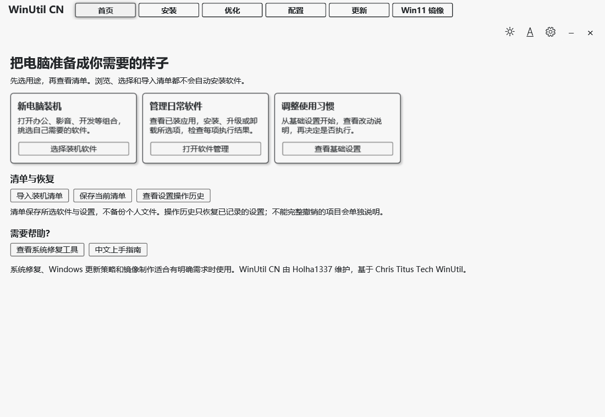
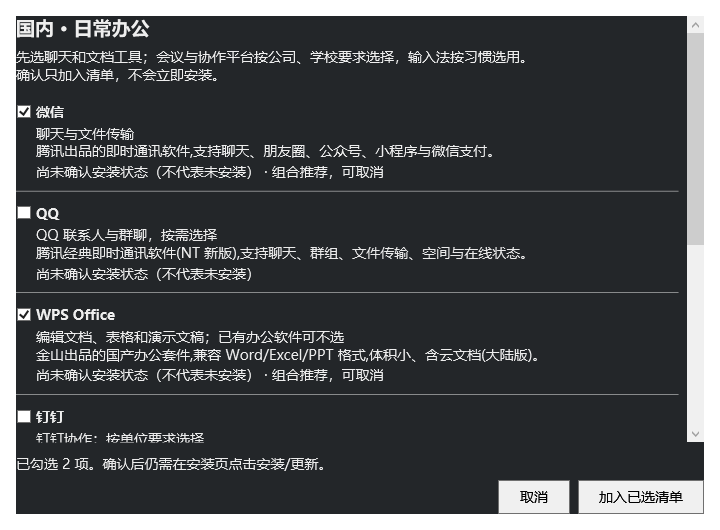

<div align="center">
  
</div>

<h1 align="center">WinUtil CN · 中文装机与维护助手</h1>

<p align="center">从新电脑装机到日常维护，先选用途、再看清单、最后执行。<br>基于 Chris Titus Tech Windows Utility，由 <a href="https://github.com/yasewang1337-svg">Holha1337</a> 汉化与维护。</p>

<p align="center">
  <a href="https://github.com/yasewang1337-svg/winutil-cn/releases/latest"></a>
  <a href="https://github.com/yasewang1337-svg/winutil-cn/actions/workflows/unittests.yaml"></a>
  
  
  <a href="LICENSE"></a>
</p>

<p align="center">
  <a href="https://github.com/yasewang1337-svg/winutil-cn/releases/latest/download/WinUtil-CN.exe"></a>
</p>

<p align="center">
  <a href="#快速开始">快速开始</a> ·
  <a href="#界面预览">界面预览</a> ·
  <a href="docs/content/userguide/getting-started/_index.md">使用指南</a> ·
  <a href="https://github.com/yasewang1337-svg/winutil-cn/releases/latest">更新记录</a> ·
  <a href="https://github.com/yasewang1337-svg/winutil-cn/issues/new/choose">反馈问题</a>
</p>

## 从你要做的事开始

| 新电脑，按需装机 | 日常用，集中维护 |
| :--- | :--- |
| **挑选软件组合**<br>办公、开发、影音等 10 组候选，查看用途、调整选择，再加入清单。 | **管理常用软件**<br>安装、升级或卸载前查看计划，完成后逐项查看结果与日志。 |
| **看清系统改动**<br>从基础设置开始；默认方案不含批量卸载应用或禁用服务。 | **处理失败项目**<br>所选软件分别报告成功、失败、跳过或需重启，支持只重试失败项。 |
| **复用装机选择**<br>导出软件与设置清单，下次导入、核对勾选后再执行。 | **查看设置历史**<br>记录已登记的注册表与服务启动配置，按记录恢复支持的项目。 |

## 界面预览

<div align="center">
  
  <p><sub>从首页进入装机、软件管理与基础设置；浏览和导入清单不会自动执行。</sub></p>
</div>

<details>
<summary><b>展开查看：浅色主题与软件组合选择</b></summary>

### 浅色主题



### 按用途调整软件组合



</details>

<sub>预览由当前版本的实际 WPF / XAML 界面渲染，展示布局与选择流程；不代表所有系统操作都已完成真机验证。</sub>

## 快速开始

1. **下载中文版** → [WinUtil-CN.exe](https://github.com/yasewang1337-svg/winutil-cn/releases/latest/download/WinUtil-CN.exe)，或到[发布页](https://github.com/yasewang1337-svg/winutil-cn/releases/latest)查看版本说明与 SHA256 校验文件。
2. **双击打开** → 按 Windows 提示授予管理员权限，从首页选择用途。
3. **核对后执行** → 调整软件或设置清单，查看操作范围，执行后检查每项结果。

> **使用环境**：Windows 11。EXE 内嵌本版本脚本，使用系统自带的 PowerShell 5.1，无需另装 PowerShell 7。准备包管理器、下载安装软件和更新仍需联网。

<details>
<summary><b>习惯命令行？使用 PowerShell 启动</b></summary>

从同一[发布页](https://github.com/yasewang1337-svg/winutil-cn/releases/latest)下载 `winutil-cn.ps1` 与 `SHA256SUMS.txt`，先计算哈希并核对清单：

```powershell
Get-FileHash .\winutil-cn.ps1 -Algorithm SHA256
```

核对来源、内容和哈希后，在管理员 PowerShell 中运行 `& .\winutil-cn.ps1`。执行策略或杀软拦截的处理见[安全告警说明](docs/SECURITY.md)；不要通过关闭防护或添加排除项启动。

</details>

## 操作前，了解这些

- **选择之后再执行。** 确认软件组合只加入清单；图形界面导入清单只替换勾选，不自动安装或修改系统。组合中的安装状态来自会话缓存，“尚未确认”不等于未安装。
- **恢复有范围。** 设置历史可恢复有记录的注册表值和服务启动配置；已删除应用、清理文件及脚本的其他改动不在完整恢复范围内，也不能替代个人文件备份。
- **全部升级有区别。** “查看全部升级操作”覆盖包管理器可识别的软件，只提供整批结果与日志；不提供逐软件待更新清单或软件版本回退。
- **优先使用默认 WinGet。** 如果改用 Chocolatey，请先按其官方说明完成安装；本工具不再下载并直接执行 Chocolatey 初始化脚本。自动登录与 PowerShell 配置安装入口改为打开官方指南。

具体步骤和边界见[中文上手指南](docs/content/userguide/getting-started/_index.md)。

## 文档导航

| 我想…… | 从这里开始 |
| :--- | :--- |
| 第一次使用，了解每步怎么做 | [快速上手](docs/content/userguide/getting-started/_index.md) · [软件组合推荐](docs/content/userguide/recommendations/_index.md) |
| 查找设置、修复和更新功能 | [用户指南](docs/content/userguide/_index.md) · [常见问题](docs/content/faq.md) · [已知问题](docs/content/KnownIssues.md) |
| 通过 AI 客户端查询或操作 | [MCP 服务器](mcp/README.md) |
| 修改翻译、参与开发 | [汉化层说明](汉化/README.md) · [架构与设计](docs/content/dev/architecture.md) · [贡献指南](.github/CONTRIBUTING.md) |
| 了解构建方式与上游同步 | [EXE 启动器](tools/launcher/README.md) · [维护说明](docs/MAINTENANCE.md) · [上游同步进度 #5](https://github.com/yasewang1337-svg/winutil-cn/issues/5) |

## 遇到问题

出现杀毒告警或“Windows 已保护你的电脑”时，先按[安全告警说明](docs/SECURITY.md)区分检测类型、核对文件哈希并保留告警记录。开源、数字签名或单次扫描通过都不能保证没有问题。

先查看软件结果窗口中的原因，通过 **打开日志文件夹** 获取详细记录，再到[本项目 Issues](https://github.com/yasewang1337-svg/winutil-cn/issues/new/choose)反馈。请附上 **项目版本、Windows 版本、启动方式、复现步骤和相关错误段落**。

<details>
<summary><b>展开查看日志位置</b></summary>

| 内容 | 默认位置 |
| :--- | :--- |
| 软件任务结果与日志 | `%LOCALAPPDATA%\WinUtil-CN\Logs\Packages` |
| 系统设置历史 | `%LOCALAPPDATA%\WinUtil\TweakHistory` |
| 一般运行日志 | `%LOCALAPPDATA%\winutil\logs` |
| 启动错误 | `%TEMP%\winutil-cn-error.log` |

</details>

## 开发与自动化

<details>
<summary><b>从源码构建中文版</b></summary>

```powershell
git clone https://github.com/yasewang1337-svg/winutil-cn.git
cd winutil-cn
pwsh -File 汉化\run-all.ps1
pwsh -File tools\Test-Build.ps1
powershell -NoProfile -File tools\Test-Build.ps1
```

构建产物为中文版 `winutil.ps1`。完整回归测试需要 Pester 5.7.1；EXE 构建方法见[启动器说明](tools/launcher/README.md)。

翻译数据集中在汉化层，中文组合、主题和可靠性改进另行维护。同步上游时需核对配置、控件 key、功能与翻译兼容性；当前基线及迁移差异见[维护说明](docs/MAINTENANCE.md)。

</details>

<details>
<summary><b>命令行预设、配置清单与 MCP</b></summary>

图形界面选择方案只勾选项目；命令行 `-Preset` / `-Config` 是**自动执行入口**，使用前必须核对配置内容。

| 设置方案 | 当前内容 |
| :--- | :--- |
| `Minimal`（基础设置） | 减少推荐应用、增加任务栏结束任务入口 |
| `Standard`（标准） | 基础设置，加活动历史策略和更新对等传输设置 |
| `Advanced`（高级，仅图形界面） | 标准方案，加创建还原点和经典右键菜单 |

自动模式仅支持软件操作及可记录的基础注册表设置（含受支持的开关）；脚本、服务、预装应用移除（Appx）、DNS 和系统功能等复杂操作需要在图形界面核对。具体项目见 [config/preset.json](config/preset.json)。

[MCP 服务器](mcp/README.md)可让支持 MCP 的客户端查询软件、组合和系统设置，并按接口要求预览、确认操作。

</details>

## 致谢与许可

感谢 [Chris Titus Tech 与上游贡献者](https://github.com/ChrisTitusTech/winutil)提供 Windows Utility，感谢 [constansino/WinUtil_CN](https://github.com/constansino/WinUtil_CN) 提供借用层翻译。本项目是独立维护的中文本地化分支，沿用 [MIT 许可证](LICENSE)。中文版本的下载、构建与反馈均使用本仓库入口。

<div align="center">
  <a href="https://github.com/yasewang1337-svg"></a>
  <p><b>让中文用户更容易用好自己的 Windows。</b><br><sub>欢迎改进翻译、提交问题、分享装机经验；如果它帮到了你，也欢迎点亮一颗 Star。</sub></p>
  <p>合作与推广 · 品牌合作、工具联动请联系 <a href="https://github.com/yasewang1337-svg">Holha1337</a></p>
</div>
