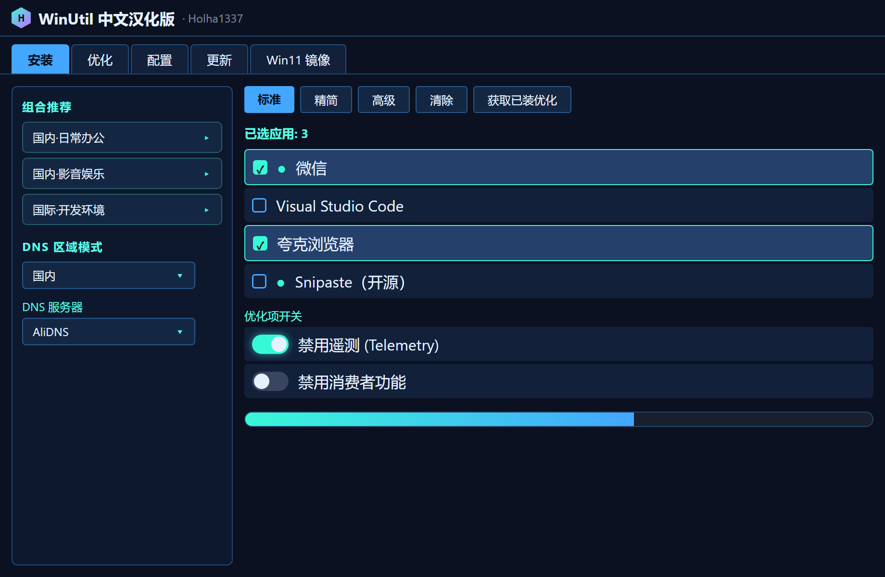

<div align="center">
  
</div>

<h1 align="center">WinUtil 中文汉化版</h1>

<p align="center">Chris Titus Tech's Windows Utility · 中文本地化分支</p>
<p align="center"><b>汉化作者 · 首席维护者：<a href="https://github.com/yasewang1337-svg">Holha1337</a></b></p>

<p align="center">
  
  
  <a href="https://github.com/yasewang1337-svg/winutil-cn/releases/latest"></a>
  <a href="https://github.com/yasewang1337-svg/winutil-cn/releases"></a>
</p>
<p align="center">
  <a href="https://www.npmjs.com/package/winutil-cn-mcp"></a>
  <a href="LICENSE"></a>
  <a href="https://github.com/yasewang1337-svg/winutil-cn/stargazers"></a>
</p>

一套精心整理的 Windows 系统任务合集：一键**安装**软件、用**优化项**给系统瘦身、用**配置**排查故障、并管理 **Windows 更新**。每次重装 Windows 后跑一遍，快速回到顺手的状态。本项目是 [ChrisTitusTech/winutil](https://github.com/ChrisTitusTech/winutil) 的**中文本地化分支**——把图形界面、软件介绍、优化项说明和文档都翻成中文。

<div align="center">
  
  <p><i>界面预览 · 暗黑霓虹主题（Holha1337 × gamesense 风）</i></p>
</div>

**✨ 特色一览**：全中文界面 · 暗黑霓虹主题 · Holha 专属图标 · 21 款国货软件 · 一键装机组合（国内/国际×场景）· DNS 国内/国际开关 · 一键换源（pip/npm/yarn/conda/go）· **AI 驱动配置（MCP，让 Claude 帮你按意图配机器）** · 离线自包含 EXE

---

## 汉化覆盖（已真机验证）

✅ 实测：GUI 中文显示正常、winget 安装功能跑通（实测装 Docker）。

- **界面骨架**：选项卡 / 菜单 / 按钮 / 提示，以及全部分类名
- **优化项与功能**：65 项 tweaks + 29 项 feature 的标题与说明
- **软件介绍**：applications 共 191 条软件描述
- **运行时提示**：MessageBox 弹窗 + ToolTip 共 62 对
- **专属软件层**：额外收录上游未含、但中国开发者常用的软件（如 Docker Desktop）

翻译数据集中在汉化层，中文软件组合、主题和可靠性修复另行维护。同步上游时需要核对控件 key、配置和功能兼容性。机制细节见 [汉化层说明](汉化/README.md)。

---

## 快速开始

> **必须以管理员身份运行**，因为它会对系统进行全局修改。

### 方式一：一键运行中文版（推荐）

以管理员身份打开 PowerShell / 终端，粘贴运行——自动拉取最新中文版：

```powershell
irm https://github.com/yasewang1337-svg/winutil-cn/releases/latest/download/winutil-cn.ps1 | iex
```

> 首次启动会初始化 winget 并加载软件列表。如果持续没有响应，请查看 `%LOCALAPPDATA%\winutil\logs`；启动错误另存于 `%TEMP%\winutil-cn-error.log`。反馈时附上版本、启动方式和相关错误段落。

### 方式二：本地构建（开发 / 自定义）

想改翻译或自己编译，clone 后跑汉化流程：

```powershell
git clone https://github.com/yasewang1337-svg/winutil-cn.git
cd winutil-cn
pwsh -File 汉化\run-all.ps1        # 重新汉化 + 编译，产出中文版 winutil.ps1
Start-Process pwsh -Verb RunAs -ArgumentList '-NoProfile -ExecutionPolicy Bypass -File .\winutil.ps1'
```

### 方式三：英文原版（上游托管）

只想跑英文原版、无需中文：

```powershell
irm https://christitus.com/win | iex        # 稳定版
irm https://christitus.com/windev | iex     # 开发版
```

### 如何打开管理员终端

- **开始菜单：** 右键点击「开始」→ 选择 *终端（管理员）* 或 *Windows PowerShell（管理员）*
- **搜索：** 按 `Windows 键`，输入 `PowerShell` 或 `Terminal`，然后按 `Ctrl + Shift + Enter`

---

## 自动化 / 预设

无需手动勾选，直接套用一份预定义配置（在构建好的中文版上运行）：

```powershell
& .\winutil.ps1 -Preset Standard
```

| 预设 | 说明 |
|--------|-------------|
| `Standard`（标准） | 适合大多数用户的均衡默认配置 |
| `Minimal`（精简） | 改动最小、人人适用 |
| `Advanced`（高级） | 面向高级用户的深度优化 |

各预设的具体内容见 [`config/preset.json`](config/preset.json)。

---

## 中文文档

已随本仓库一并汉化，可直接在 GitHub 上阅读：

- [快速上手](docs/content/userguide/getting-started/_index.md) —— 启动方式与首批操作
- [**软件组合推荐**](docs/content/userguide/recommendations/_index.md) —— 按 国内/国际 × 场景 策展的一键装机清单
- [用户指南](docs/content/userguide/_index.md) —— 应用 / 优化项 / 功能 / 更新 / 自动化 / Win11 创建器
- [常见问题（FAQ）](docs/content/faq.md)
- [已知问题](docs/content/KnownIssues.md)
- [架构与设计](docs/content/dev/architecture.md) —— 面向开发者

---

## 🤖 AI 集成（MCP · 独一份）

winutil-cn 自带一个 **MCP 服务器**，让 **Claude 等 AI 智能体按意图帮你配 Windows**——你说「把这台配成国内开发环境」，AI 就自动搜软件、装软件、套用组合、换国内源。这是它区别于普通汉化版的核心。

```bash
cd mcp && npm install
claude mcp add winutil-cn -- node "绝对路径/winutil-cn/mcp/index.js"
```

暴露的工具：`search_apps`（搜 213 条软件含国货）· `list_bundles`（一键装机组合）· `install_apps`（winget 安装）· `switch_mirror`（换源）。详见 [mcp/README.md](mcp/README.md)。

---

## 跟上游同步

上游同步需要同时验证配置、控件和翻译兼容性。当前维护基线与迁移差异见 [维护说明](docs/MAINTENANCE.md)，同步请求跟踪于 [Issue #5](https://github.com/yasewang1337-svg/winutil-cn/issues/5)。建议在独立分支合并选定的稳定版，解决冲突后运行：

```powershell
pwsh -File 汉化\run-all.ps1
pwsh -File tools\Test-Build.ps1
powershell -NoProfile -File tools\Test-Build.ps1
```

完整回归测试需 Pester 5.7.1，命令见 [维护说明](docs/MAINTENANCE.md)。各 apply 脚本会报「未命中 / 缺 key」，据此把新增条目补进对应翻译数据文件；构建或语法检查失败时应先修复再发布。详见 [汉化层说明](汉化/README.md)。

想参与贡献代码，请见 [贡献指南](.github/CONTRIBUTING.md)。

---

## 来源与许可

- **上游**：[ChrisTitusTech/winutil](https://github.com/ChrisTitusTech/winutil)（MIT）
- **借用层翻译**：[constansino/WinUtil_CN](https://github.com/constansino/WinUtil_CN)
- 本项目沿用 **MIT** 许可（见 [LICENSE](LICENSE)）。

> ⚠️ 非官方项目。运行会涉及系统级修改，操作前请先创建系统还原点或备份重要数据。

---

## 汉化作者

<div align="center">
  <a href="https://github.com/yasewang1337-svg">
    
  </a>
  <h3>Holha1337</h3>
  <p><b>WinUtil 中文汉化 · 首席维护者</b></p>
  <p><i>能为中国开发者提供更好的帮助，是我最开心的事情。未来会更好。💙</i></p>
</div>

## 📣 推广位

<div align="center">
  <a href="https://github.com/yasewang1337-svg/winutil-cn">
    
  </a>
  <p><i>品牌合作 · 广告投放 · 工具联动 —— 触达每一位重装 Windows 的中国开发者。合作请联系 <a href="https://github.com/yasewang1337-svg">Holha1337</a>。</i></p>
</div>

<br>

<sub>本项目基于 <a href="https://github.com/ChrisTitusTech/winutil">ChrisTitusTech/winutil</a>（MIT）汉化，感谢上游作者与贡献者的开源工作。</sub>
